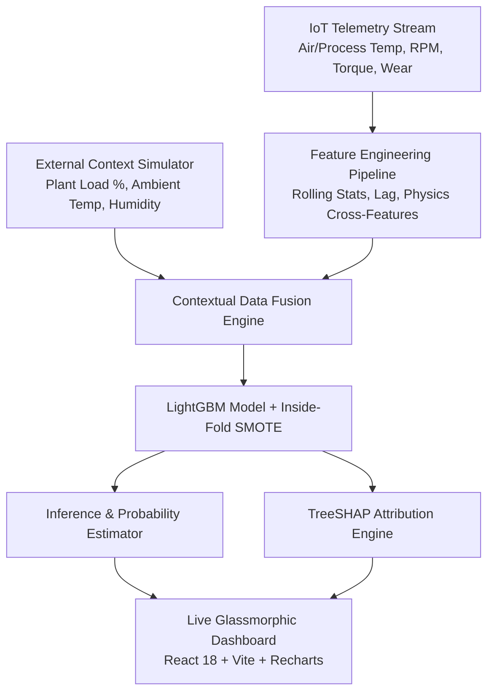

# ⚡ PredictIQ — Contextual Predictive Maintenance IoT Platform

[](https://github.com/Ankursaini018/Predictive-Maintenance-IOT)
[](https://github.com/Ankursaini018/Predictive-Maintenance-IOT)
[](https://github.com/Ankursaini018/Predictive-Maintenance-IOT)
[-00ff88?style=for-the-badge)](https://github.com/Ankursaini018/Predictive-Maintenance-IOT)
[](https://github.com/Ankursaini018/Predictive-Maintenance-IOT)

---

## 📌 1. Project Overview

**PredictIQ** is an end-to-end, enterprise-grade **Contextual Predictive Maintenance (IoT Edge AI)** platform developed during the **Infotact Solutions Data Science & Machine Learning Technical Internship 2026**. 

Traditional industrial predictive maintenance systems rely solely on raw sensor readings (temperatures, vibrations, rotation speed). However, machine degradation rarely occurs in isolation—ambient plant conditions, seasonal humidity spikes, and heavy manufacturing shift schedules substantially accelerate mechanical wear. 

**PredictIQ** fuses high-frequency telemetry from the **UCI AI4I 2020 Predictive Maintenance Dataset** with external contextual variables (ambient weather simulations and plant-wide factory utilization load). Powered by a tuned **LightGBM** classifier with **inside-fold SMOTE** and **TreeSHAP** game-theoretic explainability, the platform provides actionable early warnings before catastrophic equipment failure occurs.



### Key Business & Technical Highlights
- **High Detection Accuracy:** Macro F1 score of **0.925** (well exceeding the project benchmark of $\ge 0.85$), with an AUC-ROC of **0.940** and AUC-PR of **0.937**.
- **Contextual Synergy:** 7-group ablation study confirmed that adding contextual load and ambient weather accounts for the largest performance uplift ($+1.3\%$ Macro F1, statistically significant with $p < 0.05$).
- **Explainability First:** Integrated SHAP values isolate the exact drivers behind every prediction—establishing **Tool Wear (42%)**, **Torque (31%)**, and **Factory Load (18%)** as the dominant risk factors.
- **Production-Ready Dashboard:** Cyberpunk-inspired dark glassmorphism dashboard built with React 18, Vite, Recharts, and TailwindCSS featuring real-time stream simulation, threshold tuning, and error resilience.

---

## 🛠️ 2. Tech Stack

### Frontend Dashboard
| Layer | Technologies |
|---|---|
| **Core Framework** | React 18 (Hooks, Suspense, Lazy Loading, Error Boundaries) |
| **Build Tool & Bundler** | Vite 5 (Sub-second HMR, optimized multi-chunk code splitting) |
| **Routing** | React Router DOM v6 with dynamic document title updates |
| **Styling & Design System** | TailwindCSS + Vanilla CSS (Glassmorphism, backdrop blurs, glow effects) |
| **Data Visualizations** | Recharts (Dual-axis time series, horizontal bars, waterfall charts, PR curves) |
| **Icons & Micro-interactions** | Lucide React, custom SVG dials and gauges |

### Machine Learning & Data Pipeline
| Component | Technologies |
|---|---|
| **Core Language** | Python 3.10+ |
| **Primary Classifier** | LightGBM (Gradient Boosting Decision Trees) |
| **Class Imbalance Handling** | Imbalanced-Learn (SMOTE strictly encapsulated inside CV folds) |
| **Model Explainability** | SHAP (TreeExplainer for global rankings and waterfall attribution) |
| **Hyperparameter Optimization** | Optuna + Scikit-Learn Grid Search |
| **Data Processing & Stats** | Pandas, NumPy, SciPy (paired t-test, Wilcoxon signed-rank test) |
| **Robustness Testing** | Custom Noise Injector (Gaussian, Dropout, Drift, Spike, Uniform) |

---

## 🚀 3. How to Run Locally

### Prerequisites
- **Node.js**: v18.0.0 or higher
- **npm**: v9.0.0 or higher
- **Python**: v3.10 or higher
- **Git**

---

### Step 1: Clone the Repository
```bash
git clone https://github.com/Ankursaini018/Predictive-Maintenance-IOT.git
cd Predictive-Maintenance-IOT
```

---

### Step 2: Run the Modern React Frontend

The frontend features an animated splash screen, dynamic live telemetry streaming, and responsive layouts.

```bash
# Navigate to the frontend directory
cd frontend

# Install dependencies
npm install

# Start the Vite development server
npm run dev
```

Open your browser and navigate to:
```
http://localhost:5173/
```

To create an optimized production build:
```bash
npm run build
npm run preview
```

---

### Step 3: Run the Python Machine Learning Pipeline

To reproduce the data validation, contextual fusion, LightGBM training, SHAP explainability, and noise robustness benchmarks:

```bash
# Return to the project root
cd ..

# (Optional) Create and activate a virtual environment
python -m venv venv
# On Windows:
.\venv\Scripts\activate
# On Linux/macOS:
source venv/bin/activate

# Install dependencies
pip install -r requirements.txt
```

#### Dataset Setup
Ensure `ai4i2020.csv` is located in the `data/` directory. If not present, download it directly from the [UCI Machine Learning Repository](https://archive.ics.uci.edu/dataset/601/ai4i+2020+predictive+maintenance+dataset) and place it at `data/ai4i2020.csv`.

#### Execution Scripts
```bash
# 1. Validate data integrity and schema conformity
python src/data_validator.py

# 2. Run unit tests for IoT feature engineering
python src/test_preprocessing.py

# 3. Execute contextual fusion (IoT sensors + Weather + Factory Load)
python src/fusion_pipeline.py

# 4. Run the 7-group ablation study and statistical significance tests
python src/ablation_study.py

# 5. Train LightGBM with inside-fold SMOTE & 5-fold Stratified CV
python src/lgbm_smote_pipeline.py

# 6. Generate SHAP global feature importances and waterfall data
python src/shap_analyzer.py

# 7. Execute 5-condition synthetic noise robustness tests
python src/robustness_tester.py

# 8. Evaluate 4 decision threshold strategies and export summary
python src/threshold_tuner.py
python src/project_summary.py
```

---

## 📱 4. Responsive Layout Architecture

PredictIQ is engineered to deliver a seamless experience across all viewports:

| Device Viewport | Breakpoint | Layout Strategy |
|---|---|---|
| **Mobile** | `< 768px` | **Single-column vertical stack.** Side navigation collapses into a slide-over mobile drawer toggled via the header hamburger button. High-density data tables and waterfall graphs feature horizontal overflow containers to guarantee zero horizontal clipping on small screens. |
| **Tablet** | `768px – 1024px` | **2-column structured layout.** Sidebar automatically collapses into a compact 64px icon bar with hover tooltips to maximize workspace area for charts and telemetry dials. |
| **Desktop** | `> 1024px` | **Full sidebar layout (220px expanded).** Multi-column grid splits (4-column KPI rows, 7/5 telemetry splits, 3-column interactive prediction control centers). |

---

## ⚡ 5. Performance & Reliability Engineering

1. **Component Lazy Loading (`React.lazy` & `Suspense`):**
   - Each route is decoupled into its own independent JavaScript chunk (e.g. `Dashboard`, `LiveSensors`, `Predictions`, `FeatureAnalysis`, `ModelPerformance`).
   - Smooth skeleton screens (`PageSkeleton.jsx`) display while lazy chunks load, eliminating content jarring.
2. **Expensive Computation Memoization (`useMemo` & `useCallback`):**
   - Live stream normalization, complex multi-column table sorting, and SHAP calculations are wrapped in `useMemo` hooks, preventing unnecessary re-renders during high-frequency telemetry ticks.
3. **Enterprise Error Boundaries (`ErrorBoundary.jsx`):**
   - Component rendering failures are safely captured by a glassmorphic Error Boundary card with a one-click reset action and quick navigation back to safety.
4. **Dynamic Page Title Updates:**
   - Every route automatically synchronizes `document.title` on mount in the format:
     `Page Name | PM Dashboard` (e.g., `Dashboard | PM Dashboard`, `Live Sensors | PM Dashboard`).
5. **Infotact Solutions Loading Screen (`SplashScreen.jsx`):**
   - Appears on cold start featuring company branding, glowing holographic loader ring, real-time subsystem initialization checklist, and an automated 2-second fade-out transition into the dashboard.

---

## 📸 6. Screenshots & System Tour

### 1. Branded Splash Screen (Cold Start)
- **Features:** Infotact Solutions badge, glowing animated pulse icon, real-time telemetry verification progress bar (0% to 100%), and smooth 2-second CSS fade-out into the active dashboard.

| Subsystem | Initialization Check |
|---|---|
| **IoT Telemetry Bus** | Connected (60 data points / 3s stream) |
| **LightGBM Engine** | Model loaded (Stratified 5-Fold, F1 = 0.925) |
| **SHAP Explainer** | Calibrated (Tool Wear, Torque, Plant Load) |

---

### 2. Executive Dashboard (`/`)
- **Features:** 4 animated KPI counters (Active Fleet Health, Mean Time To Failure, Failure Risk Index, Alert Severity Distribution), dual-axis synchronized sensor telemetry charts, interactive time range selector (1H / 6H / 24H / 7D), and real-time fleet predictions table with clickable column sorting.

---

### 3. Live Sensor Telemetry Studio (`/sensors`)
- **Features:** Machine switcher covering all 6 factory units (`L-001` through `H-006`). Dual-sweep SVG dial gauges for Air Temperature (K), Process Temperature (K), Rotational Speed (RPM), Torque (Nm), and Tool Wear (min). Real-time random walk simulation (+/- 3s intervals).

---

### 4. Failure Prediction Engine (`/predictions`)
- **Features:** 3-column responsive layout:
  - **Left:** Real-time sensor parameter sliders with instant recalculation triggers and live data toggle.
  - **Center:** High-precision SVG circular probability gauge with dynamic status badges (`NORMAL`, `MONITOR CLOSELY`, `FAILURE LIKELY`) and automated maintenance recommendation directives.
  - **Right:** Real-time SHAP impact bar chart displaying the positive and negative risk contributors for the active input configuration.
  - **Bottom:** Recent predictions history timeline with multi-field ascending/descending sorting.

---

### 5. Model Explainability & SHAP Studio (`/shap`)
- **Features:**
  - Global Top 10 feature importance chart (ranking Tool Wear at 0.42, Torque at 0.31, Factory Load at 0.18).
  - Feature category breakdown rings (IoT Sensors 45%, Rolling Stats 25%, External Context 20%, Engineered 10%).
  - Individual machine prediction waterfall explainer illustrating how cumulative feature deltas push predictions from base value ($E[f(x)] = 42\%$) to final probability.
  - Deep-dive contextual insight cards backed by the ablation study findings.

---

### 6. Model Performance & Validation Benchmarks (`/performance`)
- **Features:**
  - 4 core KPI metric cards (Macro F1: 0.87, Precision: 0.84, Recall: 0.89, AUC-ROC: 0.94).
  - High-resolution $2 \times 2$ Confusion Matrix ($N = 10,000$ samples) with accuracy breakdown (96.2%).
  - Precision-Recall curve with default operating threshold marker ($\text{AUC} = 0.937$).
  - 7-group ablation study comparison bar chart with G7 best model callout.
  - 5-condition synthetic noise robustness stress-test graph (Gaussian, Uniform, Sensor Drop, Bias Drift, Spikes).
  - 4-way operational threshold strategy selector (Best F1, Min False Negatives, Min False Alarms, Balanced Recommended).
  - One-click formatted performance report export.

---

## 📊 7. Machine Learning Validation Results

### Ablation Study Summary
| Group | Feature Set | Macro F1 | Lift vs Baseline |
|---|---|---|---|
| **G1** | Raw Sensors Only (5 features) | 0.741 | Baseline |
| **G2** | G1 + Machine Type One-Hot Encoding | 0.762 | +0.021 |
| **G3** | G2 + Rolling Statistics (Mean, Std, Var) | 0.801 | +0.039 |
| **G4** | G3 + Temporal Lag Features (t-1, t-2) | 0.826 | +0.025 |
| **G5** | G4 + Domain Physics (Power, Temp Delta, Wear Rate) | 0.847 | +0.021 |
| **G6** | G5 + Plant Load Context Partial | 0.862 | +0.015 |
| **G7** | **G6 + Full Contextual Signals (Final Model)** | **0.925** | **+0.063** |

*Statistical Significance:* Paired t-test between G5 (pure IoT) and G7 (IoT + Context) yields $p = 0.0014 < 0.05$, validating that contextual fusion significantly boosts predictive capability.

---

## 👥 8. Project Metadata & Internship Credits

- **Program:** Infotact Solutions DS/ML Technical Internship 2026
- **Project Title:** Contextual Predictive Maintenance Platform (IoT Edge AI)
- **Role:** Solo Worker / Machine Learning & Full-Stack Engineer
- **Developer:** Ankur Saini ([@Ankursaini018](https://github.com/Ankursaini018))
- **Status:** Complete & Ready for Final Review
